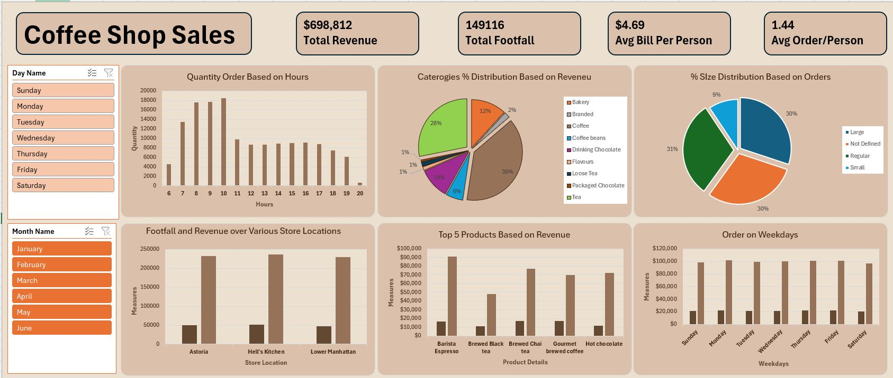

# Coffee Shop Sales Dashboard Portfolio Project

This repository contains a data analysis and visualization portfolio project based on a coffee shop's sales dataset. The objective was to clean the transactional data, build an interactive dashboard to display key metrics, and summarize findings in a concise Q&A report.

## Project Overview

- Cleaned the `CoffeeShop.xlsx` dataset by handling missing values, standardizing categorical labels, and parsing date/time fields.
- Used pivot tables and visualizations to explore sales patterns across hours, weekdays, months, locations, and product categories.
- Built a dashboard to present key performance indicators (total revenue, customer footfall, average bill per person, average orders per person) and highlight top-performing products and categories.
- Summarized the insights and recommendations in a report to practice documentation skills.

## Dashboard Snapshot

Below is a snapshot of the sales dashboard created for this project:

The dashboard conveys total revenue, footfall, average bill, and orders per person, along with breakdowns by hour, weekday, month, store location, product category, and size distribution.

## Learning Process

This project served as a hands-on exercise in:

- Data cleaning and transformation in Excel.
- Creating pivot tables and charts to extract insights.
- Designing an effective dashboard to tell a data story.
- Writing a Q&A-style report to document findings.
- Managing a portfolio project end-to-end and publishing it on GitHub.

Feel free to clone this repository to explore the dataset and recreate the analysis.
