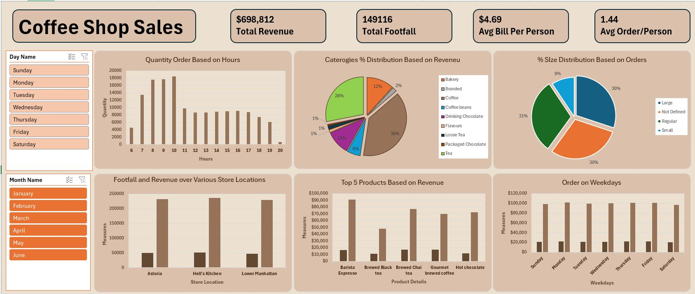

# Coffee Shop Sales Dashboard

*Insights into coffee shop sales patterns using Excel and interactive dashboards*

This repository contains a data analysis and visualization portfolio project based on a coffee shop's sales dataset. The objective was to clean the transactional data, build an interactive dashboard to display key metrics, and summarize findings in a concise Q&A report.

## Project Overview

- Cleaned the `coffeeShop.xlsx` dataset by handling missing values, standardizing categorical labels, and parsing date/time fields.
- Used pivot tables and visualizations to explore sales patterns across hours, weekdays, months, locations, and product categories.
- Built a dashboard to present key performance indicators (total revenue, customer footfall, average bill per person, average orders per person) and highlight top‑performing products and categories.
- Summarized the insights and recommendations in a report to practice documentation skills.

## Dashboard Snapshot

Below is a snapshot of the sales dashboard created for this project:

The dashboard conveys total revenue, footfall, average bill, and orders per person, along with breakdowns by hour, weekday, month, store location, product category, and size distribution.

## Learning Process

This project served as a hands‑on exercise in:

- Data cleaning and transformation in Excel.
- Creating pivot tables and charts to extract insights.
- Designing an effective dashboard to tell a data story.
- Writing a Q&A‑style report to document findings.
- Managing a portfolio project end‑to‑end and publishing it on GitHub.

## Setup & Usage

1. **Clone the repository**: `git clone https://github.com/RIFATAR/coffee-shop-sales-dashboard.git` and open the folder.
2. **Open the dataset**: Navigate to the `data/` folder and open **coffee_shop_sales_dataset.xlsx** in Microsoft Excel.
3. **Clean the data**: Handle missing values, standardize categorical labels, and parse date/time fields as demonstrated in this project.
4. **Analyze and visualize**: Use pivot tables and charts in Excel to replicate the analysis. Explore metrics like total revenue by hour, weekday, month, store location, and product category.
5. **Recreate the dashboard**: Follow the dashboard snapshot for inspiration and build your own interactive dashboard to present key KPIs.

## Technologies Used

- **Microsoft Excel** – for data cleaning, pivot tables, charts, and dashboard creation.
- **Pivot tables & charts** – to summarize sales data and derive insights.
